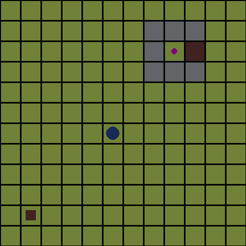

# Locked Gem Environment

**Locked Gem** is a simple grid-based Reinforcement Learning environment with a sparse reward and a required sequence of actions.

The agent must first activate a pressure plate to unlock a door before it can reach the gem. The agent only observes the environment as an image (pixels), with no symbolic state information.


---

## Objective

1. Go to the **pressure plate**
2. Unlock the **door**
3. Go through the door
4. Collect the **gem**

Collecting the gem ends the episode and gives a reward of **+1**.

---

## Rewards

| Event         | Reward |
| ------------- | ------ |
| Collect gem   | +1.0   |
| Anything else | 0.0    |

The reward is intentionally sparse.

---

## Observations

* The observation is a single **RGB image** of the grid
* No access to positions, coordinates, or symbolic information
* The agent must learn everything from pixels alone

---

## Actions

Discrete movement actions:

* Up
* Down
* Left
* Right

---

## Episode End

The episode ends when:

* The gem is collected, or
* A maximum number of steps is reached

---

## Why This Environment Is Interesting

Locked Gem is designed to be challenging despite its simple rules:

* Sparse terminal reward
* Long sequence of required actions
* Subgoal dependency (plate → door → gem)
* Pixel-only observations

A key goal of this environment is **generalization**.

Agents are expected to:

* Train on a set of environment configurations (layouts)
* Generalize to **new, unseen configurations**

This requires learning *what* to do (activate plate, pass door, collect gem), not memorizing paths or positions.

---

## Usage Example

```python
import gymnasium
import locked_gem_env

env = gymnasium.make(
    "locked_gem_env/LockedGem-v0",
    size=12,
    render_mode="human",
    max_episode_steps = 50
)

obs, info = env.reset(seed=42)

done = False

total_reward = 0.0

while not done:
    action = env.action_space.sample()
    obs, reward, terminated, truncated, info = env.step(action)
    done = terminated or truncated
    total_reward += reward

print("Episode reward:", total_reward)

env.close()
```

---

## Visualization

The environment supports RGB rendering, as shown in the example above.

---

## License

MIT License (or specify otherwise).

---

## Author

Pedro Mota
